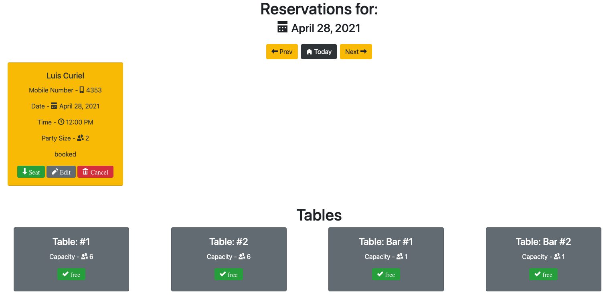
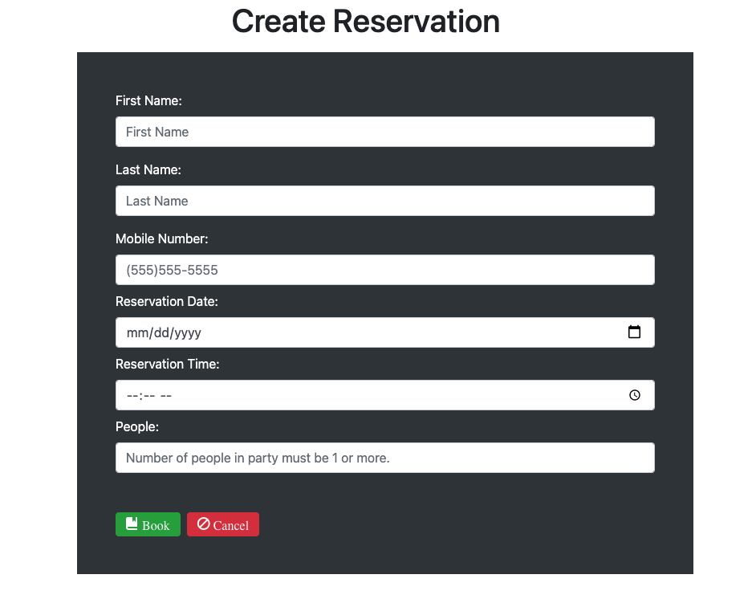
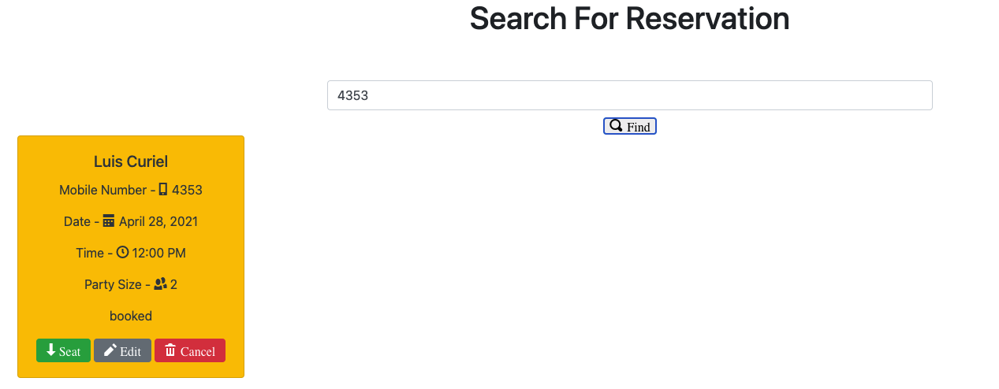
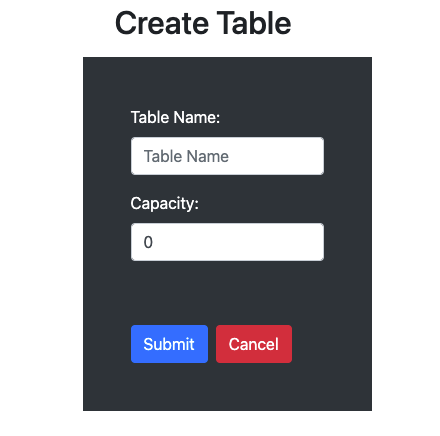

# Thinkful-Final-Capstone: Restaurant Reservation System

## Live Site
[Restaurant Reservation System](https://front-end-942mlohrp-ljcuriel10.vercel.app/dashboard "Restaurant Reservation System")  

## Application Summary
A Restaurant Reservation App that is used to create and record reservations and table assignments.  
The user can create new reservations and search for existing reservations by the guests phone number.  
The application also lets you seat reservations at a table and makes the table occupied when a reservation 
is sat it also allows the table to be switched back to unoccupied to let you seat another reservation at that table.

## API Documentation

| Route       | Method      | Status Code | Description   |
| :---        |    :----:   |     :----:   |        ---:  |
| /reservations      | GET   | 200  | Returns a list of reservations for the current date |
| /reservations?date=####-##-##      | GET |  200    | Returns a list of reservations for the given date |
| /reservations      | POST  | 201    | Creates a new reservation |
| /reservations/:reservation_id      | GET  | 200     | Returns the reservation for the given ID |
| /reservations/:reservation_id      | PUT  | 200     | Updates the reservation for the given ID |
| /reservations/:reservation_id/status      | PUT  | 200     | Updates the status of the reservation for the given ID |
| /tables   | GET  | 200      | Returns a list of tables     |
| /tables   | POST  | 201      | Creates a new table     |
| /tables/:table_id   | GET   |   200   | Returns the table for the given ID     |
| /tables/:table_id/seat   | PUT | 200      | Seats a reservation at the given table_id     |
| /tables/:table_id/seat   | DELETE  | 200      | Changes the occupied status to be unoccupied for the given table_id     |

## Installation
1. Run `npm install` to install project dependencies.
2. To start the server and client run `npm start`
3. connect to a postgresql database by creating .env files for the backend and frontend
 ```js
// back-end .env example -> Connects to database
DATABASE_URL=enter-your-production-database-url-here
DATABASE_URL_DEVELOPMENT=enter-your-development-database-url-here
DATABASE_URL_TEST=enter-your-test-database-url-here
DATABASE_URL_PREVIEW=enter-your-preview-database-url-here
LOG_LEVEL=info

// front-end .env example -> Connects to server
REACT_APP_API_BASE_URL=http://localhost:5000
```

### Project Screenshots





